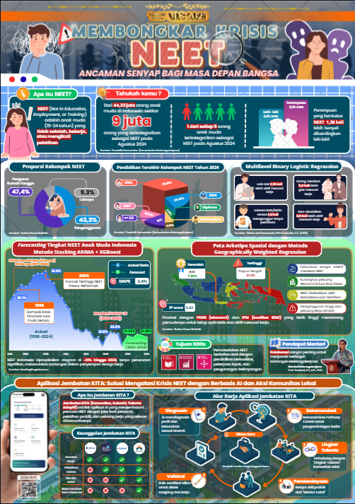

<h1 align="center">Analysis of the NEET Phenomenon in Indonesia</h1>

<p align="center">
  <b>Olympic of Statistics (OLS) 2025 — Universitas Hasanuddin</b><br/>
  Team: <b>Choco Minto</b>
</p>

<p align="center">
  
  
  
  
</p>

---

<p align="center">
  
</p>

---

## Summary

This repository contains all research artifacts and data analysis for the **Olympic of Statistics (OLS) 2025** competition held by Universitas Negeri Makassar. Our research theme:

> **"Lost Potential: A Multidimensional Analysis of the NEET (*Not in Education, Employment, or Training*) Phenomenon Among Indonesian Youth Aged 15–24"**

The study analyses **9.9 million Indonesian youth** classified as NEET using a multi-method approach: cluster analysis, spatial regression, machine learning, and time-series forecasting. Final outputs include a research paper and an infographic.

---

## Methodology & Analysis Pipeline

The analysis pipeline consists of **six stages** that complement each other:


| # | Stage | Method | Notebook |
|---|-------|--------|----------|
| 1 | **Exploratory Data Analysis** | Agglomerative Hierarchical Clustering (AHC), Silhouette Score, Cluster Map | [EDA1.ipynb](notebooks/EDA1.ipynb) |
| 2 | **Regression Analysis** | Pearson Correlation, Simple Linear Regression (GRDP vs HDI) | [Regresi.ipynb](notebooks/Regresi.ipynb) |
| 3 | **Feature Importance** | Random Forest Classifier, Feature Importance Scoring | [RF.ipynb](notebooks/RF.ipynb) |
| 4 | **Spatial Analysis** | Multiscale Geographically Weighted Regression (MGWR) | [MGWR.ipynb](notebooks/MGWR.ipynb) |
| 5 | **Logistic Regression** | Multinomial Logistic Regression (MNLogit) on Sakernas micro-data | [RLM.ipynb](notebooks/RLM.ipynb) |
| 6 | **Forecasting** | Hybrid ARIMA + XGBoost with GridSearchCV | [Fore.ipynb](notebooks/Fore.ipynb) |

---

## Key Findings

### Province Clustering

All 38 Indonesian provinces were classified into **5 archetypes** based on NEET rate, Open Unemployment Rate (TPT), Mean Years of Schooling (RLS), and GRDP per Capita:

| Cluster | Description | Example Provinces |
|---------|-------------|-------------------|
| **A** | Structural Challenges | Papua |
| **B** | Established Economic Hub | DKI Jakarta, East Kalimantan, Riau |
| **C** | New Growth Engine | North Maluku, Central Sulawesi |
| **D1** | Developing Indonesia – Type 1 | Central Java, East Java, NTT |
| **D2** | Developing Indonesia – Type 2 | West Java, North Sumatra, Bali |
| **D3** | Developing Indonesia – Type 3 | Highland Papua, Central Papua |

### Key Determinants (Random Forest)

| Factor | Importance Score |
|--------|-----------------|
| Mean Years of Schooling (RLS) | **0.362** |
| Open Unemployment Rate (TPT) | **0.336** |
| GRDP per Capita | **0.301** |

### NEET Forecast 2025–2029

| Year | Predicted NEET (%) |
|------|-------------------|
| 2025 | 21.32 |
| 2026 | 21.08 |
| 2027 | 21.52 |
| 2028 | 21.32 |
| 2029 | 21.08 |

> The hybrid ARIMA + XGBoost model predicts Indonesia's NEET rate will **remain stable around 21%** over the next five years without significant policy intervention.

---

## Tech Stack & Dependencies

| Category | Libraries |
|----------|-----------|
| **Data Wrangling** | `pandas`, `numpy` |
| **Visualization** | `matplotlib`, `seaborn`, `plotly` |
| **Machine Learning** | `scikit-learn`, `xgboost`, `pycaret` |
| **Time Series** | `pmdarima` (auto_arima) |
| **Spatial Analysis** | `mgwr` |
| **Statistics** | `statsmodels`, `scipy` |

---

## Getting Started

### Prerequisites

```bash
pip install pandas numpy matplotlib seaborn plotly scikit-learn xgboost pmdarima pycaret mgwr statsmodels scipy
```

### Running the Analysis

```bash
# 1. Clone the repository
git clone <repo-url>

# 2. Navigate to the docs folder
cd docs

# 3. Launch Jupyter Notebook
jupyter notebook

# 4. Open notebooks in pipeline order:
#    EDA1.ipynb -> Regresi.ipynb -> RF.ipynb -> MGWR.ipynb -> RLM.ipynb -> Fore.ipynb
```

> **Note:** The primary notebook is [Fore.ipynb](notebooks/Fore.ipynb), which contains the end-to-end forecasting pipeline.

---

## Competition Deliverables

| Deliverable | File |
|-------------|------|
| Research Paper | `Penyempurnaan Riset Data NEET_.docx` |
| Final Presentation | `PPT_Final_OLS007I_Choco Minto.pptx` |
| Infographic | See template in root project |
| OLS Handbook | `BUKU SAKU OLS TAHUN 2025.pdf` |

---

## Data Sources

- **Badan Pusat Statistik (BPS)** — National Labour Force Survey (Sakernas), GRDP, HDI, and employment indicators
- **ILO / World Bank** — International comparative NEET data
- **GeoJSON Indonesia** — [superpikar/indonesia-geojson](https://github.com/superpikar/indonesia-geojson)

---

<p align="center">
  <i>Built by Team Choco Minto</i>
</p>
